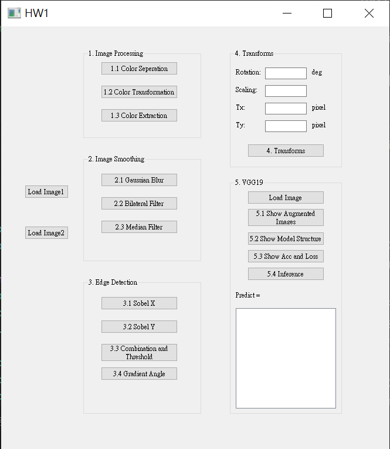

# hw1_opencvdl_2023_fall
This is a repository of my hw1 of opencvdl, whose full course name should be Image Processing, OpenCV and Deep Learning...I think..XD
# Requirement
The packages I used in this homework is listed in the `requirement.txt` file.

# Hardware Environment
    - CPU
    Intel(R) Core(TM) i9-10900X CPU @ 3.70GHz

    - RAM
	128 GB
	速度:	2666 MHz

	- GPU
    NVIDIA GeForce RTX 2080 SUPER
	驅動程式版本:	31.0.15.4601
	驅動程式日期:	2023/10/26
	DirectX 版本:	12 (FL 12.1)
	專屬 GPU 記憶體	0.4/8.0 GB
	共用 GPU 記憶體	0.0/63.8 GB
	GPU 記憶體	0.4/71.8 GB

# Usage
Due to my laziness, I did not make it a `.exe` file. So, the way to check this program is to open the `hw1.py` and run it from CLI. In my computer (actually the lab computer... haha), I use VSCode to do this.

# Demo
